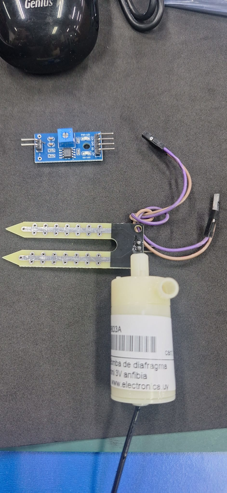

# Informe de Avance 1: Agosto 202x

## 12/8/2026
- inicio armado de grupo (Ricardo ferreira)
- Eleccion del proyecto y evaluacion de costos
- [Incluir:]
  - [Tareas completadas]
  - [Problemas encontrados y soluciones/alternativas propuestas]
  - [Próximos pasos]
  - [Imágenes o videos ilustrativos del avance]

## 24/08/2026
- Descripcion del Proyecto :
- El sistema detecta cuándo la tierra está seca y activa automáticamente una pequeña bomba de agua para regar la planta.
- Cuando la humedad alcanza un nivel adecuado, la bomba se apaga.
- [Incluir:]
  - Componentes
micro:bit como controlador.
Sensor de humedad del suelo.
Mini bomba de agua de 3–5 V.
Relé o módulo MOSFET para controlar la bomba.
Recipiente para almacenar el agua.
Tubo pequeño para llevar el agua hasta la maceta.
Maceta con planta.
Fuente de alimentación/pilas.
Cables y protoboard.
Opcional: LED o pantalla para indicar el estado.
    - [Próximos pasos]
   - [Imágenes o videos ilustrativos del avance]

## 26/8/202x
- Trabajo en clase , investigacion de posibilidades de fabricacion
- videos para ver proyectos similares -https://www.youtube.com/watch?v=kZpA9VxRFow
- Se adquire sensor de humedad y minibomba de agua 3v en el mercado
  - [Tareas completadas]
  -Viendo las dificultades que se presentan al intentar hacer el proyecto con microbit , manejamos la opcion d hacerlo con arduino
  - | Imagen       | Bomba sensor |

 

## [13]/9/2026
- [Trabajando con los mateiales que dispongo , comiezo a reealizar las conexiones]
- 
  - [Adjunt fotografia con lo realizado]
  - [Al no entender como conectar el modulo relé , esperaaree para consullta en la proxima clase]
  - [proxima clasee]
  - []

## Nota
En este enlace encontrarás un [ejemplo como debe completarse el informe de avance](avance_ejemplo.md).
