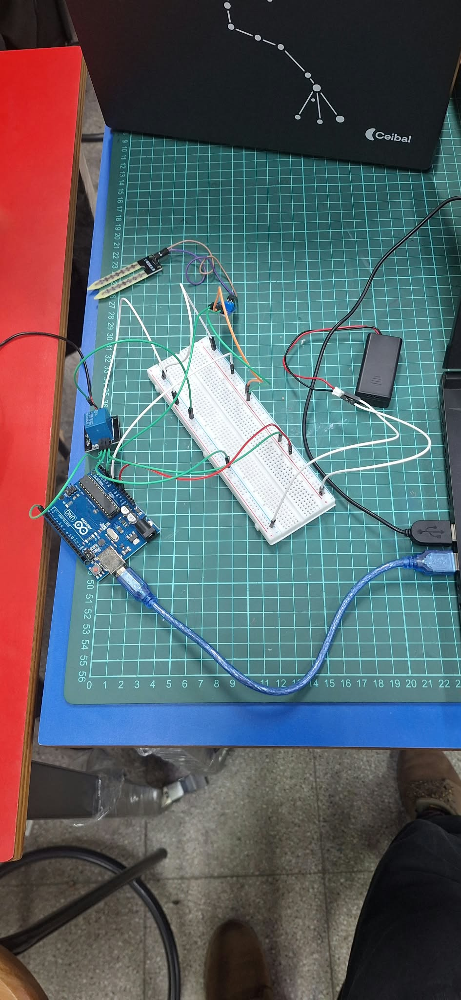

# Informe de Avance 2: Septiembre 2026

## 30/9/2026

### Tareas completadas
- Se completa las conecciones del sistema
- Se coonecta por cable USB plaqueta arduino UNO
- Instalamos software arduino IDE y probamos conexión de PC a plaqueta.
- Se copia y ejecuta codigo para probar plaqueta arduino.
- Se baja y prueba codigo para realizar mediciones de sensor y visualizamos los valores reportados

### Problemas encontrados y soluciones/alternativas propuestas
- Luego de resueltos los problemas de coneccion encontrados , se realizan todas las pruebas de forma satisfactoria.

### Imágenes o videos ilustrativos del avance
_Foto conexión del sistema_

_Captura de pantalla mostrando lecturas del sensor de humedad_

### Proximos pasos
Probar la bomba funcionando
